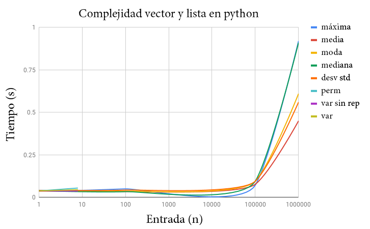
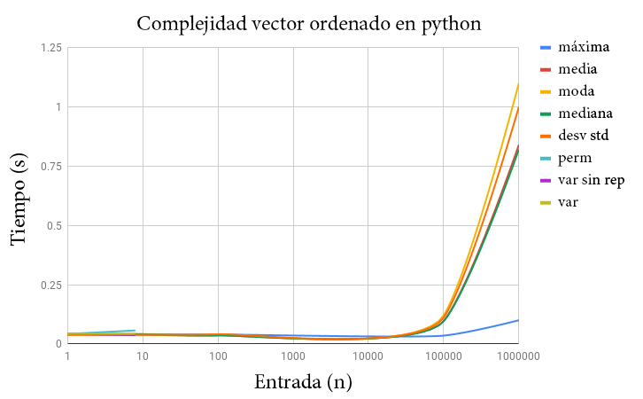

### (75.29 / 95.06) - Teoría de Algoritmos - FIUBA

# Informe Trabajo Práctico 1

## Grupo : 3 + 1
## Integrantes
  * Matias Onorato (93179)
  * Juan Cruz Opizzi (99807)
  * Francisco Strambini (92135)
  * Alexis Daciuk (97630)

---

## Introducción: Algoritmo Gale-Shapley
### El problema
En 1962 Gale y  Shapley estudiaron el problema de emparejar dos grupos, entendiendo como emparejamiento la asignación de un individuo de un grupo con el otro, y viceversa.

En este problema tenemos dos grupos, ***A*** y ***B***, de *n* individuos cada uno, siendo *n* la dimensión del problema.  Además, cada individuo del grupo ***A*** y ***B*** tiene una lista de preferencia donde ordena de forma discriminada, estricta y de forma decreciente a cada individuo del del grupo al cual no pertenece, según su orden de preferencia para formar pareja.

El objetivo del problema consiste es crear un emparejamiento en el que cada pareja sea satisfactoria para los individuos que la crean en base a las preferencias de cada uno. es decir crear un emparejamiento estable.

Para el problema planteado, Gale y shapley lograron implementar un algoritmo que logra este emparejamiento mencionado.

```
Inicialmente todos los proponentes estan sin emparejar

MIENTRAS (exista un proponente sin pareja)
  -propone a los que no haya propuesto segun su
  orden de preferencia.  
  SI (el propuesto esta libre)
    se acepta propuesta
  SI NO
    SI (el propuesto prefiere a su actual pareja)
      no se arma la pareja
    SI NO
      se arma la pareja
    FIN SI
  FIN SI
FIN MIENTRAS
```

para este algoritmo, Gale y shapley demostraron que:

* El algoritmo termina en un número finito de pasos y termina, a la sumo, en *n^2* pasos.
* El algoritmo produce un emparejamiento estable, es decir que no existe ningun par bloqueante entre un individuo de ***A*** y otro de ***B*** que quiera romper un emparejamiento constituido.
* El algoritmo Gale-Shapley genera un emparejamiento optimo para los proponentes y pesimo para los propuestos.

## Parte 1 - Resolución del problema del Club “PICA-PICA”
### 1.1 Variante de Gale-Shapley con Indiferencias

Encontramos que podemos ejecutar una variante conocida del algoritmo de Gale -Shapley si tomamos un correcto criterio de desempate en caso de ser necesario.

Si a diferencia del algoritmo tradicional, en nuestra variante permitimos más de un jugador en las lista de preferencias con un mismo numero de preferencia, ordenada de forma decreciente, es decir dado *a* ∈ ***A***, *x,y,z* ∈ ***B*** jugadores de los Grupos ***A*** y ***B***, un diccionario `{p:preferencia, j:jugador}` formando la lista `a → {p:1, j:x} →{p:2, j:y} →{p:2, j:z}` como lista de referencia de ***A***, el algoritmo de pareo con indiferencias sigue ofreciendo un correcto funcionamiento, entregando una pareja para cada jugador en un pareo conocido como debilmente estable en los casos donde exista indiferencia. Este pareo sigue ofreciendo un pareo estable por definición, ya que no altera el funcionamiento del algoritmo de Gale-shapley al momento de su comprobación de estabilidad.

La variante es representada por el algoritmo:

```
Inicialmente todos los proponentes estan sin emparejar

MIENTRAS (exista un proponente sin pareja)
  -propone a los que no haya propuesto segun su
  orden de preferencia.  
  SI (el propuesto esta libre)
    se acepta propuesta
  SI NO
    SI (el propuesto prefiere debilmente a su actual pareja)
      no se arma la pareja
    SI NO
      se arma la pareja
    FIN SI
  FIN SI
FIN MIENTRAS
```


### 1.2 - Estabilidad de la Variante
Por lo visto en la introducción, el algoritmo de Gale-Shelley es por naturaleza estable, por lo cual analizamos nuestra variación para ver si su nueva implementación produce algún cambio que afecte su estabilidad a la hora de encontrar un posible bloqueo luego de formadas las parejas.

Si definimos como criterio de desempate en el pareo (y por ende al consultar la preferencia) que la preferencia del proponente tiene que ser estrictamente mayor a la referencia de la pareja del propuesto, por más que esta sea la misma en más de un caso, el algoritmo de Gale-Shapley no encuentra alteraciones en su estabilidad. Esto se debe a que con el criterio mencionado, ante cada intento de formar una pareja entre los jugadores de ambos grupos, al tener que ser esta preferencia estrictamente mayor,  ningún jugador podrá cambiar su pareja para ninguno de los casos en los que se repita ese mismo valor de preferencia nen un pareo debilmente estable, conservándose la estabilidad al no generarse ningún bloqueo.

Por el contrario, si se permite en un caso de empate que se pueda cambiar de pareja si la preferencia además de ser mayor pueda ser igual, algunas preferencias con el mismo número de preferencia podrían querer cambiar la pareja que forma la primera preferencia con número de preferencia repetida, rompiendo la estabilidad.

### 1.3 - Complejidad de la Variante
La ejecución del algoritmo de Gale- Shappley se puede pensar como el recorrido de una matriz formada por las listas de preferencias de los integrantes de un grupo, por ejemplo *a,b,c* ∈ ***A*** -  *x,y,z* ∈ ***B*** representaría la matriz *3x3*

| a | b | c |
|:-:|:-:|:-:|
| {p: 1, j: x} | {p:1, j:x} | {p:1, j:z} |
| {p: 2, j: y} | {p:1, j:z} | {p:1, j:y} |
| {p: 2, j: z} | {p:3, j:y} | {p:2, j:x} |

para la cual se empieza a recorrer cada una de las preferencias hasta que todos los elementos de ***A*** forman pareja. En cada caso se ejecuta una simple comparación de complejidad *O(1)* para formar pareja, y en el peor de los casos hay que recorrer toda la matriz para que todas las parejas queden formadas.

por lo tanto el algoritmo de Gale-Shapley presenta una complejidad *O(n^2)*, siendo *n* el número de integrantes de un grupo.

### 1.4 - ¿Es posible un desempate mediante un tiro de moneda?
Esta opción no es posible.

Al igual que el caso considerado al final del punto 1.2, no podemos permitir que ante un empate se generen casos donde el criterio de selección de pareja no sea arbitrario. Si permitimos que el azar resuelva un empate en una lista de preferencias, en lugar de constatar ante cada caso de cambio de pareja el pareo debilmente estable antes mencionado, se podrían generar casos de bloqueo que romperían la estabilidad del pareo.

### 1.5 - Desarrolle un algoritmo que dado una pareo y las preferencias determina si el mismo es matching estable. ¿Qué complejidad algorítmica tiene?

ver 1.6 para ejecutar el algoritmo

#### Análisis de Complejidad

analizamos por partes:

hilo la parte inicial en el main.py

```
    if punto == "1.5":
        print('Parejas por archivo de pareo:')
        nombre_archivo_pareo = sys.argv[3]        
        grupoA, grupoB = armarParejas(jugadores, nombre_archivo_pareo) # O(armarParejas(n,a))

    if grupoA != None:           
        for jugador in grupoA: # O(n)
            print(jugador.nombre + ", " + jugador.pareja.nombre)
        print ('Es estable?:', parejasEstables(grupoA,grupoB)) # O(parejasEstables(n,n))

```

*O(algoritmo 1.5) = O(armarParejas(n,a)) + O(n) + O(parejasEstables(n,n))*

carga de parejas por archivo
```
def armarParejas(jugadores, nombre_archivo_pareo):    
    grupoA = jugadores[slice(0,len(jugadores)//2)] # O(1)
    grupoB = jugadores[slice(len(jugadores)//2,len(jugadores))] # O(1)

    archivo_pareo = open(Path("../../assets/txt/" + nombre_archivo_pareo),"r") # O(1)
    lineas_pareo = archivo_pareo.read().splitlines() # O(n)

    for pareo in lineas_pareo: # O(n)
        jugador1 = next(filter(lambda x: x.nombre == pareo.split(',')[0].strip(),jugadores)) # O(n)
        jugador2 = next(filter(lambda x: x.nombre == pareo.split(',')[1].strip(),jugadores)) # O(n)
        jugador1.formarPareja(jugador2) # O(1)

    return grupoA, grupoB # O(1)
```

*O(armarParejas(n,a)) = O(n^2)*

```
def parejasEstables(grupoA, grupoB):
    for jugadorA in grupoA: # O(n)
        for jugadorB in grupoB: # O(n)
            if jugadorA.pareja != jugadorB and jugadorA.prefiere(jugadorB) and jugadorB.prefiere(jugadorA): # O(1)
                return False
    return True   
```

*O(parejasEstables(n,n)) =  O(n^2)*

por lo tanto

*O(algoritmo 1.5) = O(n^2) + O(n) + O(n^2)*
*O(algoritmo 1.5) = O(n^2)*


### 1.6 - Programación de los algoritmos

instrucciones ejecución del TP:

Primero, generar los archivos de preferencias y ranking general

```
cd TP1/src/tools
python player_generator.py
```

el mismo guarda un *archivo_jugadores.rank* en la carpeta *TP1/assets/txt* con el nombre segun indica el tp, por ejemplo *20_jugadores.rank* y un archivo de preferencia por jugador *jugador_ranking.pref*

#### punto 1.1
luego, para ejecutar el punto 1.1 realizar los siguientes pasos:

```
cd TP1/src/Primera_Parte
python main.py 1.1 archivo_jugadores.rank
```

se imprime en pantalla las parejas que forman un pareo estable y se comprueba algoritmicamente dicha estabilidad.

#### punto 1.5
para ejecutar el punto 1.5 realizar los siguientes pasos:
Colocar un archivo *parejas_alternativas.txt* en el directorio *TP1/assets/txt* con las parejas propuestas, junto a los archivos de jugadores y preferencias.

luego ejecutar los siguientes comandos:

```
cd TP1/src/Priemra_Parte
python main.py 1.5 archivo_jugadores.rank parejas_alternativas.txt
```

La salida del programa imprimira las parejas cargadas y si las mismas son estables o no segun sus archivos de preferencias.


### 1.7 - ¿Tiene su programa la misma complejidad algorítmica que la teórica?

Analizo complejidad del algoritmo de Gale-Shapley

```
def armarParejasEstables(jugadores):    
    grupoA = jugadores[slice(0,len(jugadores)//2)] # O(1)
    grupoB = jugadores[slice(len(jugadores)//2,len(jugadores))] # O(1)

    proponentesLibres = len(grupoA)

    while proponentesLibres>0 : # O(n)
        for proponente in grupoA: # O(n)
            if proponente.pareja is None: # O(1)
                propuesto = proponente.proximoCandidato() # O(1)
                if propuesto.pareja is None: # O(1)
                    proponente.formarPareja(propuesto) # O(1)
                    proponentesLibres -= 1  # O(1)
                elif propuesto.prefiere(proponente): # O(n) (prefiere(a) recorre la lista de jugadores)
                    proponente.formarPareja(propuesto) # O(1)                
    return grupoA, grupoB
```

*O(armarParejasEstables(n)) = O(n^3)*

Esta complejidad difiere de la complejidad teórica de gale shapley tradicional, que es O(n^2), porque a diferencia de esta, en este caso la complejidad de comparar las preferencias pasa de O(1) (comparar index en un vector) a O(n) (buscar los números de preferencia de cada jugador y su pareja y compararlo)

## Parte 2 - Funciones matemáticas / estadísticas

### 2.1 - Proponga algoritmos para cada una de las resoluciones

los algoritmos estan propuestos en  */TP1/src/Segunda_Parte*

en *implementación_lista.py* estan implementadas todas las funciones para la lista y el array. En python encontramos la particularidad que los array y las listas funcionan de la misma forma, ambas quedan determinadas por el comando []

en *implementación_lista_ordenada.py* estan implementadas todas las funciones para el vector ordenado

en *implementación_abb.py* estan implementadas todas las funciones para nuestra implementación elegida, un arbol de busqueda binario.


### 2.2 - Analisis de complejidad algorítmica

#### Lista y vector en python:

* Máximo
  * Temporal: *O(n)*
  * Espacial: *O(n)*
* Media
  * Temporal: *O(n)*
  * Espacial: *O(n)*
* Moda
  * Temporal: *O(n)*
  * Espacial: *O(n)*
* Mediana
  * Temporal: *O(n log n)*
  * Espacial: *O(n)*
* Desviación estándar
  * Temporal: *O(n^2)*
  * Espacial: *O(n)*
* Permutaciones del conjunto
  * Temporal: *O(n!)*
  * Espacial: *O(n!)*
* Variaciones del conjunto tomados de r elementos (r«n)
  * Temporal: *O(n!)*
  * Espacial: *O(n!)*
* Variaciones con repetición del conjunto de r elementos (r«n)
  * Temporal: *O(n!)*
  * Espacial: *O(n!)*

#### Vector ordenado:

* Máximo
  * Temporal: *O(n)*
  * Espacial: *O(n)*
* Media
  * Temporal: *O(n)*
  * Espacial: *O(n)*
* Moda
  * Temporal: *O(n)*
  * Espacial: *O(n)*
* Mediana
  * Temporal: *O(n log n)*
  * Espacial: *O(n)*
* Desviación estándar
  * Temporal: *O(n^2)*
  * Espacial: *O(n)*
* Permutaciones del conjunto
  * Temporal: *O(n!)*
  * Espacial: *O(n!)*
* Variaciones del conjunto tomados de r elementos (r«n)
  * Temporal: *O(n!)*
  * Espacial: *O(n!)*
* Variaciones con repetición del conjunto de r elementos (r«n)
  * Temporal: *O(n!)*
  * Espacial: *O(n!)*

#### Vector ordenado:

* Máximo
  * Temporal: *O(1)*
  * Espacial: *O(n)*
* Media
  * Temporal: *O(1)*
  * Espacial: *O(n)*
* Moda
  * Temporal: *O(1)*
  * Espacial: *O(n)*
* Mediana
  * Temporal: *O(n log n)*
  * Espacial: *O(n)*
* Desviación estándar
  * Temporal: *O(n^2)*
  * Espacial: *O(n)*
* Permutaciones del conjunto
  * Temporal: *O(n!)*
  * Espacial: *O(n!)*
* Variaciones del conjunto tomados de r elementos (r«n)
  * Temporal: *O(n!)*
  * Espacial: *O(n!)*
* Variaciones con repetición del conjunto de r elementos (r«n)
  * Temporal: *O(n!)*
  * Espacial: *O(n!)*


#### Arboy de Busquda Binaria:
* Máximo
  * Temporal: *O(log n)*
  * Espacial: *O(n)*
* Media
  * Temporal: *O(n)*
  * Espacial: *O(n)*
* Moda
  * Temporal: *O(n)*
  * Espacial: *O(n)*
* Mediana
  * Temporal: *O(n log n)*
  * Espacial: *O(n)*
* Desviación estándar
  * Temporal: *O(n^2)*
  * Espacial: *O(n)*
* Permutaciones del conjunto
  * Temporal: *O(n!)*
  * Espacial: *O(n!)*
* Variaciones del conjunto tomados de r elementos (r«n)
  * Temporal: *O(n!)*
  * Espacial: *O(n!)*
* Variaciones con repetición del conjunto de r elementos (r«n)
  * Temporal: *O(n!)*
  * Espacial: *O(n!)*

  ### 2.3 - Gráficos de Complejidad

  Para armar los graficos de complejidad, usamos diferentes largos de vector para medir el tiempo real de ejecucion usando el comando **time** de Linux y tomando el tiempo de ejecucion total.

  

  

  ### 2.4 - Programación Algoritmos

  Como ejecutar las distintas implementaciones

  1) Generamos el archivo txt con la cantidad de numeros que queremos, siendo **n** la cantidad de numeros
  ```
  cd TP1/src/Tools
  python number_generator.py n
  ```
  2) Ejecutar la implementacion deseada y funcion deseada conjunto
  ```
  cd TP1/src/Segunda_Parte/
  implentacion_lista.py ruta_archivo funcion r
  ```
  Siendo **r** un argumento necesario solo para las variaciones

  Las funciones son las siguientes:
  * Maximo : **maximo**
  * Media : **media**
  * Moda : **moda**
  * Mediana : **mediana**
  * Desviacion Estandar : **desviacion_estandar**
  * Permutaciones : **permutaciones**
  * Variaciones de r en r : **variaciones**
  * Variaciones de r en r con repeticion : **variaciones_con_repeticion**

  La ruta del archivo, si fue generado con el script en **tools** esta en **../assets/txt/numbers.txt**
