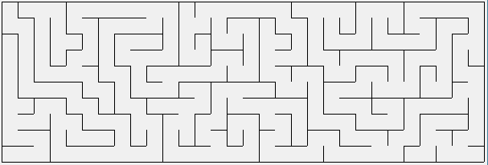
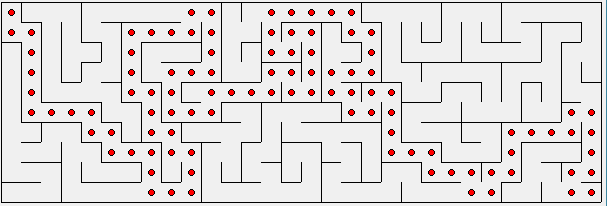

### (75.29 / 95.06) - Teoría de Algoritmos - FIUBA

# Informe Trabajo Práctico 2

## Grupo : 3 + 1
## Integrantes
  * Matias Onorato (93179)
  * Juan Cruz Opizzi (99807)
  * Francisco Strambini (92135)
  * Alexis Daciuk (97630)

---
# Parte 1 - Laberintos
## 1.1 - Generacion de laberintos

## Division y Conquista

### **Pseudocodigo**

```
1) Generas el mapa con el alto y ancho pedido

2) Mientras que el tamaño del sub-laberinto sea mayor a 4x4

    2.1) Decidir orientacion de la pared nueva

    2.2) Poner la pared con pasaje en una posicion aleatoria mientras que no tape otro pasaje

    2.3) Repetir 2) con los 2 sub-laberintos definidos por la pared nueva
```

### **Complejidad**

En el armado del algoritmo, a través del proceso de división de la matriz, se termina pasando una vez por cada celda del laberinto, por lo cual la complejidad es siempre *O(N)*

### **Implementacion**

```python
def generar_mapa(mapa):

    def dividir(mapa, x, y, ancho, alto):
        # Pongo un limite inferior para las subdivisiones
        if alto < 4 or ancho < 4:
            return

        # Busco punto de inicio de la pared, siempre va a estar sobre la pared
        # derecha o superior del recuadro definido por (x,y), ancho y alto
        # OSEA, SIEMPRE QUE ARMO UNA PARED, ES PARA ABAJO O PARA LA DERECHA
        pared_valida = False

        while not pared_valida:
            # Decido la orientacion dependiendo del tamaño de la division
            es_horizontal = (decidir_orientacion(alto, ancho) == "horizontal")

            # Defino el largo de la pared
            largo_pared = ancho if es_horizontal else alto

            # Defino aleatoriamente donde va a estar la pared
            pared_x = x + (random.randint(2, alto - 2) if es_horizontal else 0)
            pared_y = y + \
                (0 if es_horizontal else random.randint(2, ancho - 2))

            # Valido que no este frente a una puerta
            pared_valida = validar_pared(
                pared_x, pared_y, largo_pared, es_horizontal)

        poner_pared(mapa,
                    ("horizontal" if es_horizontal else "vertical"),
                    pared_x, pared_y, largo_pared)

        x_a = x
        y_a = y
        ancho_a = ancho if es_horizontal else pared_y - y
        alto_a = pared_x - x if es_horizontal else alto

        dividir(mapa, x_a, y_a, ancho_a, alto_a)

        x_b = pared_x + 1 if es_horizontal else pared_x
        y_b = pared_y if es_horizontal else pared_y + 1
        ancho_b = ancho if es_horizontal else ancho - pared_y + y - 1
        alto_b = alto - pared_x + x - 1 if es_horizontal else alto

        dividir(mapa, x_b, y_b, ancho_b, alto_b)

    dividir(mapa, 1, 1, ancho_mapa - 2, alto_mapa - 2)
```

### **Ejecución**

```
cd TP2/src/Primera_Parte
python3 generar_laberinto_dyc.py ancho alto
```

Que genera el archivo **assets/txt/laberinto_dyc.txt** donde los asteriscos representan las paredes y los espacios en blanco.

## Depth-First Search y Recursive Backtracking

La técnica dfs tiene utilidad para generar laberintos. Comenzamos con un grafo plano del cual, mediante una búsqueda en profundidad aleatoria vamos generando un subgrafo que vaya avanzando entre los nodos vecinos mascándolos como visitados hasta que se encuentre sin salida, es decir que el nodo actual no posea vecinos no visitados.  A partir de ese instante, haciendo uso de una pila, aplicamos un técnica conocida como backtraking mediante la cual comenzamos a revisar los nodos anteriores ya recorridos hasta encontrar un nuevo vecino sin visitar y volver a aplicar una búsqueda en profundidad aleatoria. Cuando la pila se quede sin elementos habremos recorrido todo el grafo inicial y el laberinto habrá quedado conformado.

### **Pseudocodigo**

El procedimiento queda determinado de la siguiente manera

```
Convertir el nodo inicial en el nodo actual y marcarlo como visitado.

Mientras queden nodos por visitar

    Si el nodo actual tiene vecinos que no han sido visitadas

        Agregar el nodo actual a la pila

        generar una arista entre el nodo actual y el nodo a visitar

        Marcar el nodo actual como visitado

        Hacer del nodo a visitar el nodo actual

    En caso contrario verificar si la pila no está vacía y

        Eliminar el nodo actual de la pila

        Hacer del último nodo de la pila el nodo actual
```
### **Analisis de Complejidad**

El algoritmo DFS tiene una complejidad *O(n)*, done n es el número de nodos del grafo. Y el backtraking es un proceso recursivo donde ante cada recursión se ve reducido el numero de nodos n que quedan sin visitar. La complejidad de dicha recursión se puede modelar como  *T(n) <= T(n/2) + T(n/3) + T(n/4) + ... + T(1)*, generarndo una complejidad O(log(n))

Por lo tanto la complejidad queda determinada por *O(n.log(n))*

### **Implementación algoritmo**

el codigo esta implementado en *laberinto_dfs.py*

El grafo plano queda representado por un vector de 2 dimensiones dentro de la propiedad grilla de la clase Laberinto. Dentro de la grilla hay instancias de la clase celda, donde en la propiedad conexiones estan conectados los vecinos que forman el sub grafo del laberinto al recorrelos.

```python
class Celda:
    def __init__(self, x, y):
        self.x = x
        self.y = y
        self.conexiones = {'N':None, 'S':None, 'E':None, 'O':None} # subgrafo mediante dfs donde estan conectadas las celdas vecinas
        self.visitado= False

        #para uso en  Dijkstra
        self.caminoMin = False
        self.distancia = -1 #infinito
        self.anterior = None

class Laberinto:
    def __init__(self,fils = 0,cols = 0,archivo = None):
        self.fils = fils
        self.cols = cols
        self.grilla = [] # grafo plano
        self.pila = []
        self.recorridoMin = []

        if type(archivo) is str:
            self.cargar(archivo)
        else:
            self.crear() # Generación de la grilla y ejecución dfs-backtraking

```
### **Ejecución**
```
cd TP2/src/Primera_Parte
python3 constructor.py dfs 10 30
```
El algoritmo genera el archivo

*TP2/assets/tst/mapa-laberinto.txt*

que contiene la representación del laberinto, donde los *  son muros y los espacios son las celdas/nodos y sus conexiones

Además imprime en pantalla un diagrama del laberinto generado:



## 1.2 - Generación camino minimo
### **Algoritmo Dijkstra**
La idea subyacente en este algoritmo consiste en ir explorando todos los caminos más cortos que parten del vértice origen y que llevan a todos los demás vértices; cuando se obtiene el camino más corto desde el vértice origen hasta el resto de los vértices que componen el grafo, el algoritmo se detiene.

Al detenerse, quedan todos los nodos del grafo con una distancia marcada desde el origen y un subgrafo que conecta el verticie final con el de inicio formando un camino mínimo

### **Pseudocodigo**
```
function Dijkstra(Grafo, source):
    por cada nodo v en Grafo:
        dist[v] := infinito
 	    anterior[v] := ninguno
 	dist[nodo_inicio] := 0 	
 	pila = todoslos los nodos en grafo
 	mientras pila tiene algun nodo:
 	    u := nodo en pila con menor distancia
 	    eliminar u de pila
 	    por cada vecino v de u: 	
            #en nuestro caso la distancia entre nodos vecinos es siempre 1
	        alt := dist[u] + 1             
 	        if alt < dist[v] 	
	        dist[v] := alt
 	        anterior[v] := u
 	return anterior[]
```

### **Analisis de Complejidad**
El algoritmo consiste en *N-1* iteraciones como máximo, en las cuales se agrega un nodo al conjunto final, siendo *N* el número de nodos. En cada iteración se realiza una búsqueda del nodo con menor distancia, de los que siguen estando en la lista de nodos con distancias sin asignar, se realiza una comparación y una suma para actualizar la distancia de los nodos vecinos lo cual tiene como cota *2(N-1)* operaciones. Por lo tanto:

*O(djkstra) = O(N-1).O(2(N-1)) = O(N^2)*


### **Implementación algoritmo**
```python
def dijkstra(self):    
    self.grilla[0][0].distancia = 0 #seteo distancia inicio
    self.grilla[0][0].caminoMin = True
    #lista de nodos
    nodos = []
    for x in self.grilla: #armo una lista con todos los nodos
        for celda in x:
            nodos.append(celda)   

    while nodos:
        nodoPos = [n for n in nodos if n.distancia != -1] #lista de nodos con distancia no infinita
        u = min(nodoPos, key=lambda x: x.distancia) #nodo con distanci minima
        nodos.remove(u)
        for v in u.obtenerConexiones(): # como maximo 4 nodos
            alt = u.distancia + 1
            if alt < v.distancia or v.distancia == -1:
                v.distancia = alt
                v.anterior = u

    return self.marcarCaminoMin(self.grilla[self.cols-1][self.fils-1]) #recorro el camino minimo desde la salida y lo devuelvo

def marcarCaminoMin(self,celda):
    if celda.anterior is not None:
        celda.caminoMin = True
        self.marcarCaminoMin(celda.anterior)
    else:            
        return
```
### **Ejecución**
```
cd TP2/src/Primera_Parte
py constructor.py dfs 10 30
py camino_min.py 'mapa-laberintos.txt'
```
El algoritmo genera el archivo

*TP2/assets/tst/mapa-laberinto-camino-min.txt*

que contiene la representación del laberinto y un camino mínimo, donde los *  son muros y los espacios son las celdas/nodos y sus conexiones, y los puntos las celdas que forman parte del camino mínimo

Además imprime en pantalla un diagrama del laberinto resuelto:



## 1.3 - Comparación de complejidad
### **Depth-First Search y Recursive Backtracking**

```python
def generar(self, celda):                
    if self.pila[-1] is not None: # O(1)
        celda.visitado = True # O(1)
        self.pila.append(self.conectarVecino(celda)) # O(4)
        self.generar(self.pila[-1]) #O(n.log(n))
    else:
        try:
            self.pila.pop() # O(1)
            self.pila.pop() # O(1)
            self.generar(self.pila[-1]) # O(n.log(n)              
        except IndexError: # O(1)
            return
```
La única complejidad que depende de n es la recursión del backtraking descripta en el pseudocodigo, por lo tanto la complejidad de la implementación es igual a la teórica

### **Dijkstra**
```python
def dijkstra(self):
    self.grilla[0][0].distancia = 0 #0(1)
    self.grilla[0][0].caminoMin = True #0(1)
    nodos = [] #0(1)
    for x in self.grilla: #0(n)
        for celda in x:
            nodos.append(celda)

    while nodos: #0(n)
        nodoPos = [n for n in nodos if n.distancia != -1]  #0(n)
        u = min(nodoPos, key=lambda x: x.distancia) #0(n)
        nodos.remove(u) #0(1)
        for v in u.obtenerConexiones(): #0(4)
            alt = u.distancia + 1 #0(1)
            if alt < v.distancia or v.distancia == -1: #0(1)
                v.distancia = alt #0(1)
                v.anterior = u #0(1)

    return self.marcarCaminoMin(self.grilla[self.cols-1] [self.fils-1]) #O(n)

def marcarCaminoMin(self,celda):
    if celda.anterior is not None: #O(1)
        celda.caminoMin = True #O(1)
        self.marcarCaminoMin(celda.anterior) #O(n)
    else:            
        return
```

*O(dijkstra) = O(3) + O(n) + O(n).(2.O(n) + O(8)) +O(n)*
*O(dijkstra) = O(n^2)*

por lo tanto la complejidad queda igual que la teorica

# Parte 2 - Golpe comando

### **Algoritmo**

```
Cargar cada entrada de la planilla en un objeto "Entrada" y agregarlo a una lista

Armar una lista de sospechosos por cada persona en la planilla desde 1 a n - 5

Recorrer la lista de lista de sospechosos buscando mas sospechosos en la planilla
pero solo desde el primer sospechoso de la lista en adelante

Recorrer la lista de sospechosos y chequear que las listas cumplan las condiciones de
tamaño valido, tiempo valido y escape valido

```
Una persona califica para una lista de sospecosos si:
  - Esta dentro de los 120 minutos de la primer entrada de la lista
  - Su estadia es menor a 120 minutos
  - Si no rompe la condicion de que el grupo estuvo junto en algun momento


El escape es valido si toda persona que no pertenece al grupo, se fue antes o ingreso despues
de la primer salida del grupo, considero valido los casos donde la salida es exactamente en el mismo
horaraio que la entrada o salida de una persona ajena.


### *Codigo*
```python
  # Cargo la planilla
  planilla = cargar_planilla(file_path)

  # Armo las listas de sospechosos
  armador = ArmadorListas(planilla)
  listas = armador.armar_listas()

  def armar_listas(self):
        # Armo una lista por cada sospechoso en la planilla de 1 a n - 5
        for sospechoso in planilla[:len(planilla) - 4]:
            self.listas.append(ListaSospechosos(sospechoso))

        # Recorro cada lista de sospechosos y busco mas sospechosos en la
        # planilla, pero solo desde el primer sospechoso de la lista en
        # adelante
        for lista in self.listas:
            posicion = planilla.index(lista.primer_sospechoso())
            for sospechoso in planilla[posicion:]:
                if lista.califica(sospechoso):
                    lista.agregar_sospechoso(sospechoso)

        self.definitiva = []

        # Chequeo condiciones, largo de lista, tiempo total de duracion
        # y que no haya personas ajenas a la banda cuando se retira la persona
        # con el botin
        for lista in self.listas:
            largo_valido = self.largo_valido(lista)
            tiempo_valido = self.tiempo_valido(lista)
            escape_valido = self.validar_escape(lista, self.planilla)
            if largo_valido and tiempo_valido and escape_valido:
                self.definitiva.append(lista)

        return self.definitiva
```

#### Metodo auxiliares
```python
def largo_valido(self, lista):
    if lista.largo() >= 5 and lista.largo() <= 10:
        return True
    else:
        return False

def tiempo_valido(self, lista):
    if lista.tiempo_total() >= 40 and lista.tiempo_total() <= 120:
        return True
    else:
        return False

def validar_escape(self, lista, planilla):
    planilla_tmp = [sospechoso
                    for sospechoso in planilla if sospechoso
                    not in lista.obtener_sospechosos()]

    # Tengo 2 casos
    # Caso 1 : Persona que entro y salio antes de que salga el sospechoso
    # con el botin
    # Caso 2 : Persona que entro y salio despues de que salga el sospechoso
    # con el botin
    # Entonces si el horario de entrada es menor al horario de
    # primera salida y el horario de salida es mayor al horario de primera
    # salida, el escape es invalido
    # Tomo como valido el caso que la salida del primer sospechoso de una
    # lista sea en el mismo momento que la entrada de una persona que no
    # pertenece al grupo
    for sospechoso in planilla_tmp:
        if sospechoso.horario_entrada < lista.primer_salida and \
                sospechoso.horario_salida > lista.primer_salida:
            return False

    return True


    def agregar_sospechoso(self, sospechoso):
        if sospechoso not in self.lista_sospechosos:
            self.lista_sospechosos.append(sospechoso)

        if sospechoso.horario_salida < self.primer_salida:
            self.primer_salida = sospechoso.horario_salida
        elif sospechoso.horario_salida > self.ultima_salida:
            self.ultima_salida = sospechoso.horario_salida

    def califica(self, nuevo_sospechoso):
        # Chequeo que haya entrado en los 120 minutos de la ventana de la lista
        if nuevo_sospechoso.horario_entrada - self.primer_entrada > 120 \
                and nuevo_sospechoso.tiempo_estadia <= 120:
            return False

        # Chequeo que el que voy a agregar, estuvo en algun momento con todo el
        # grupo de sospechosos
        # Caso 1 : entrada posterior a X persona de la lista, la entrada del
        # nuevo sospechoso tiene que ser anterior a la hora de salida de X
        # Caso 2 : la entrada es a la misma hora que la del sospechoso X,
        # cumple, ya que no existen estadias de 0 minutos
        for actual_sospechoso in self.lista_sospechosos:
            if actual_sospechoso.horario_salida <=\
                    nuevo_sospechoso.horario_entrada:
                return False

        return True

def agregar_sospechoso(self, sospechoso):
    if sospechoso not in self.lista_sospechosos:
        self.lista_sospechosos.append(sospechoso)

    if sospechoso.horario_salida < self.primer_salida:
        self.primer_salida = sospechoso.horario_salida
    elif sospechoso.horario_salida > self.ultima_salida:
        self.ultima_salida = sospechoso.horario_salida

def califica(self, nuevo_sospechoso):
    # Chequeo que haya entrado en los 120 minutos de la ventana de la lista
    if nuevo_sospechoso.horario_entrada - self.primer_entrada > 120 \
            and nuevo_sospechoso.tiempo_estadia <= 120:
        return False

    # Chequeo que el que voy a agregar, estuvo en algun momento con todo el
    # grupo de sospechosos
    # Caso 1 : entrada posterior a X persona de la lista, la entrada del
    # nuevo sospechoso tiene que ser anterior a la hora de salida de X
    # Caso 2 : la entrada es a la misma hora que la del sospechoso X,
    # cumple, ya que no existen estadias de 0 minutos
    for actual_sospechoso in self.lista_sospechosos:    # O(n)
        if actual_sospechoso.horario_salida <=\
                nuevo_sospechoso.horario_entrada:
            return False

    return True        
```

### **Análisis de Complejidad**

Lo que mayor complejidad temporal tiene, es buscar nuevos sospechosos en el metodo
armar_listas que tiene complejidad O(n * m), siendo n el largo de la planilla y m
la cantidad de lista de sospechosos

### Instrucciones de ejecución

```bash
cd TP2/src/Segunta_Parte
python3 sospechosos.py ../../assets/txt/
```

En la carpeta **assets/txt** estan los logs subidos al classroom

El resultado se guarda en un archivo en el mismo directorio del script, llamado
**sospechosos.txt**
