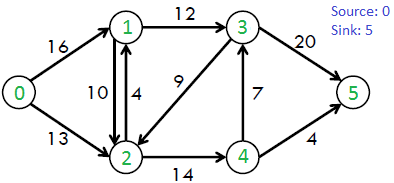

### (75.29 / 95.06) - Teoría de Algoritmos - FIUBA

# Informe Trabajo Práctico 3

## Grupo : 3 + 1

## Integrantes

-   Matias Onorato (93179)
-   Juan Cruz Opizzi (99807)
-   Francisco Strambini (92135)
-   Alexis Daciuk (97630)

* * *

# Parte 1

## El tablero

Para setear la cartografía utilizamos tres clases: `Juego.Mapa`, `Juego.Ciudad` y `Juego.Ruta`

Entre estas 3 clases dan forma a un grafo en  listas de adyacencias:

`Mapa.ciudades` contiene la primer lista de instancias Ciudad para recorrer todas las ciudades, cada ciudad guarda la información vital de cada una de ellas : imperio al que pertenece, especia generada por turno, ejércitos disponibles, si es o no metrópolis, etc.

`Ciudad.rutas` es la lista de adyacencias de cada ciudad, que guarda instancias de Ruta representando la información de  las aristas: destino y flujo de especias.

Para ejemplificar el informe, y simular una instancia de los archivos de salida,utilizamos el siguiente mapa:

## Separación del Tablero

## Selección

Para este paso utilizamos decidimos asignar prioridades de asignación para cada imperio de acuerdo a dos criterios: primero por proximidad a la metrópolis y luego por cantidad de especia producida.

Con este método maximizamos la probabilidad de mantener lo mas lejos posible al enemigo y a la vez maximizar la recolección de especia, ambas condiciones necesarias para ganar.

Utilizamos dos algoritmos: BFS y el Timsort implementado en el metodo sorted de python.

Con BFS facilitamos y bajamos la complejidad de busqueda de caminos minimos para calcular la distancia física de una ciudad con su metrópolis, debido a que con simplemente recorrer los arboles producidos cada caso siempre que marcado el camino minimo, por la naturaleza de los grafos con formas de arboles.

Arbol producidos con BFS para el imperio 1:

A continuación el método

 `sorted(listaPrefs,key=lambda x : (x['distancia'],-x['ciudad'].produccion))`

Ordena la lista de preferencias, que se almacenan en lso archivos de selección.

#### **Complejidad**

La complejidad temporal del algoritmo se puede expresar como `O (|V| + |E|)`, donde `|V|` es el número de ciudades y `|E|` es el número de rutas. En el peor caso, cada ciudad y cada ruta será visitada por el algoritmo.

## División

La división se realiza mediante un simple pareo según la reglas establecida, en este caso el mapa queda dividido ed la sigueinte forma:

#### **Complejidad**

El pareo simplemente recorre una vez, y en paralelo, la lsita de preferencias de las ciudades, por lo tanto la compeljidad es `O(|V|)`

## Cosecha y Producción

Utilizamos el algoritmo de Ford-Fulkerson para llevar adelante la recoleccion de especias.

El algoritmo provee una forma practica de transportar la mayor cantidad de especias (o flujo en general) desde una fuente a un sumidero. En nuestro caso las fuente son cada una de las ciudades pertenecientes al imperio y el sumidero la metropolis.

La siguiente es una idea simple del algoritmo Ford-Fulkerson:
1) La recoleccion inicial se setea en 0.
2) Mientras haya un camino de aumento desde cada ciudad hasta la metropolis.
        Añade la recoleccion de la ruta de la ciudad para el flujo.
3) Devuelve el flujo.

Ejemplo gráfico:

En nuestro caso, se utiliza el grafo `Imperio.ciudades` para representar el grafo que une las ciudades del imperio. Para cada una de ellas se aplica el algoritmo y se transporta la cantidad máxima de especia. El procedimiento se repite por cada ciudad y la suma de todas ellas por turno se almacena en `Imperio.cantEspecias` para luego ser guardada en el archivo correspondiente.

#### **Complejidad**

La complejidad del tiempo del algoritmo es `O(max_flujo * E)`, siendo E la cantidad de rutas existentes en el mapa del imperio.
Iteramos un loop mientras hay un camino de aumento. En el peor de los casos, podemos agregar 1 unidad de flujo en cada iteración. Por lo tanto, la complejidad del tiempo se convierte en `(max_flujo * E)`.

## Ataques

#### Minimax

Para la toma de decisiones de ambos jugadores utilizamos una tecnica llamada MinMax.

Minimax es un método de decisión para minimizar la pérdida máxima esperada en juegos con adversario y con información perfecta, utilizando un arbol de decision de forma recursiva.
El algoritmo funciona teniendo que tomar la mejor decision para uno mismo suponiendo que tu oponente escogerá la peor decision para ti.

La idea de Minimax es:

1.  Generación del árbol de decision. Se generarán todos los nodos hasta llegar a un estado terminal o determinando una profundidad concreta.

Vamos aplicando el algoritmo por un número fijo de iteraciones hasta alcanzar una determinada profundidad. En estas aplicaciones la profundidad suele ser el número de movimientos o los incluso el resultado de aplicar diversos pasos de planificación en un juego de estrategia.

2.  Cálculo de los valores de la función de utilidad para cada nodo terminal.

Para cada resultado final, cómo de beneficioso me resulta si estamos en MAX o cuanto me perjudicará si estamos en MIN.

3.  Calcular el valor de los nodos superiores a partir del valor de los inferiores. Alternativamente se elegirán los valores mínimos y máximos representando los movimientos del jugador y del oponente, de ahí el nombre de Minimax.

4.  Elegir la jugada valorando los valores que han llegado al nivel superior.

El algoritmo explorará los nodos del árbol asignándoles un valor numérico mediante una función de utilidad, empezando por los nodos terminales y subiendo hacia la raíz. La función de utilidad como se ha comentado, definirá lo buena que es la posición para un jugador cuando la alcanza.

Al aplicar el algoritmo, se suceden una serie de estados que se resumen : -1 significa que MAX gana, 0 empate o -1 pierde.

# Parte 2

### **1) Proponer una solución greedy para el problema. Mostrar el pseudocódigo.**

Guardo los precios de cada semana en una lista circular **precios_semana** de tal manera que pueda recorrer la lista las veces que sea necesaria y mantenga el orden de los precios

Guardo en producido_ultima_semana la pieza que se produjo la ultima semana, para poder chequear el cumplimiento de la condicion impuesta en  el enunciado

Recorro cada lista en **semanas** y busco la pieza que tenga el mayor precio en **semana - producido_ultima_semana**

Guardo en otra lista, las piezas a producir, ordenadas por semana.

    producido_ultima_semana = -1

    Por cada semana en n:
      precios_actual = precios_semana.siguiente()
      pieza = mayor(precios_actual - producido_ultima_semana)
      a_producir.agregar(pieza)
      producido_ultima_semana = pieza

### **2) Analizar y justificar la complejidad del algoritmo**

Iterar de 1 a n es `O(n)`

Buscar el mayor en una lista desordenada **semana - producido_ultima_semana** es `O(m - 1)`

=> `O(n + m - 1)` , siendo **n** la cantidad de semanas que se quieren calcular y **m** la cantidad de piezas que se pueden producir

### **3) Determinar si la solución es óptima. En caso negativo, en qué condiciones lo puede ser?**

Se puede ver ya con un ejemplo chico como el del enunciado, que esa solucion no es la optima.

En la primera iteracion, se elije la pieza 3, que para esa semana, es la pieza mejor paga
En la segunda iteracion, nuestras opciones se reducen a Pieza 1 y Pieza 2, al tener la misma paga, se elije por defecto Pieza 1
En la tercera iteracion, solamente podemos elegir entre la Pieza 2 y la Pieza 3, ninguna de estas 2 opciones es la mejor paga en la semana 3, por ende, esta solucion no es optima.

# Parte 3

### **A) Responda a las siguientes preguntas teóricas. Sea conciso y justifique claramente**

#### **1. Defina y explique (si es necesario con ejemplos) qué significa que un problema sea P, NP, NP-Completo y NP-Hard**

Que un problema sea **P** significa que puede resolverse en tiempo polinomico, osea, que su solucion optima tiene un costo temporal de O(n^k), con un k fijo y n siendo el tamaño del input.

La categoria **NP** corresponde a los problemas que dada una posible solucion, se puede comprobar que es valida o no en tiempo polinomico (aunque todavia no exista un algoritmo para encontrar soluciones en tiempo polinomico).

La categoria **NP Completo** agrupa a los problemas **NP** que pueden ser reducidos en tiempo polinomico a otros de la misma categoria, entonces, de encontrarse una solucion polinomica a cualquier problema de esta categoria, signifca que todos pueden resolverse en tiempo polinomial.

La categoria **NP-Hard** son problemas, que son, al menos, tan complejos como los **NP** (sin necesariamente estar en esta cateporia) y que cualquier problema **NP Completo** puede ser reducido a esta categoria en tiempo polinomial

#### **2. Tenemos un problema A, un problema B y una caja negra NA y NB que resuelven el problema A y B respectivamente. Sabiendo que B es NP**

-   Qué podemos decir de A si utilizamos NA para resolver el problema B (asumimos que la reducción realizada para adaptar el problema B al problema A el polinomial)

Siendo que no sabemos la categoria de **A**, **NA** o **NB**

Si existe una reduccion polinomial de **B** a **A** y **B** es **NP** entonces A es **NP**

-   Qué podemos decir de A si utilizamos NB para resolver el problema A (asumimos que la reducción realizada para adaptar el problema A al problema B el polinomial)

Si existe una reduccion polinomial de **A** a **B**, entonces, siendo que **B** es **NP**, entonces:

**A** puede ser **P** siendo que todos los problemas **P** son **NP**, o, **NP Completo** ya que **B** es **NP** y **A** puede ser reducido a **NP**

-   Qué pasa con los puntos anteriores si no conocemos la complejidad de B, pero sabemos que A es P?.

En caso de que **A** sea **P**, la reduccion de **B** (**NP**) a **A** (**P**) del primer problema, todavia no tiene solucion y es un problema abierto

En el segundo caso, si **A** es **P** y se reduce a **B**, **B** podria ser **P** ya que un problema polinomial reducido de forma polinomial a otro problema, sigue siendo polinomial o **NP** ya que todo problema **P** es **NP**

### **B) Demostrar que los siguientes problemas son NPC. Justificar claramente, escribiendo en pseudocódigo los algoritmos si cree conveniente**

1.  Dados 4 sets de elementos (W, X, Y, Z) (cada uno de tamaño n) y una colección C de 4-tuplas de la forma (w, x, y, z), tal que wW, xX, yY, zZ. El problema de 4-Dimensional Matching consiste en identificar si existen N 4-tuplas de C tal que ninguna de ellas tienen ningún elemento en común con las demás (es decir, si una tupla es (w1, x1, y1, z1) ∈ C y otra es (w2, x2, y2, z2) ∈ C, son distintas si w1 ≠ w2, x1 ≠ x2, y1 ≠ y2, and z1 ≠ z2). Sabiendo que el problema de 3-Dimensional Matching (el mismo que el anteriormente explicado pero con 3 sets y considerando 3-tuplas) es NP-Completo, demostrar que el problema de 4-Dimensional Matching es NP-Completo también.

Se puede ver que 4-DM es **NP** ya que se puede comprobar en tiempo polinomial O(n) que una tupla de 4 elementos es disjunta, recorriendo la tupla y comparando cada elemento con el anterior.

Ahora, para ver que es **NP Completo**, nos bastaria con encontrar una reduccion a 3-DM que sabemos por enunciado que es **NP Completo**

Si consideramos una instancia de 3-DM con {X,Y,Z} de dimension N y C el conjunto de 3-tuplas que cumplen con la condicion de ser disjuntas

Armamos nuestro caso de 4-DM con {W,X,Y,Z} de dimension N y C' el conjunto de 4-tuplas definidas de tal manera que (Wi, Xj, Yk, Zl) con (Xj, Yk, Zl) en C y con i en 1 .. n

Entonces, si tenemos un conjunto H de las 3-tuplas disjuntas en C, encontrar el conjunto de 4-tuplas disjuntas en C' se resuelve de forma polinomica, agregando los elementos Wi tal que las 4-tuplas sigan siendo disjuntas

2.  Se tiene un conjunto de n tareas, con tiempo de ejecución ti​, una fecha límite de finalización di y una ganancia vi otorgada si se finaliza antes que su tiempo límite. Se pide devolver si existe alguna planificación que obtenga una ganancia total mayor o igual a K sin ejecutar dos tareas a la vez.

Se puede ver que este problema es **NP** ya que se puede comprobar en tiempo polinomial que un conjunto de tareas cumple las condiciones necesarias.

Ahora, para ver que es **NP Completo**, nos bastaria con encontrar una reduccion a otro problema que sabemos que es **NP Completo**

Si representamos las tareas en un grafo de intervalos, encontramos que el problema se reduce a encontrar el conjunto independiente de peso maximo y el problema de decision de un set independiente es **NP Hard**, entonces, si puedo reducir el problema a uno **NP Hard** este es **NP Completo** (por definicion de NP Hard).
